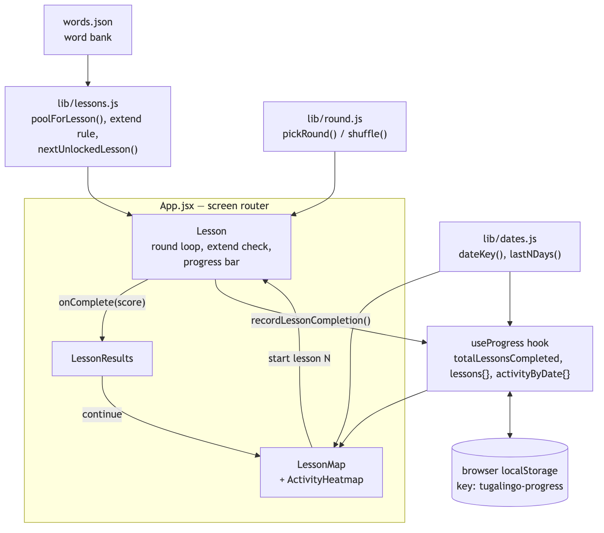
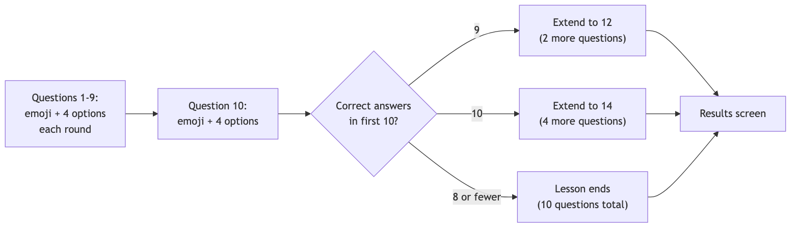

# Architecture

## Stack

| Layer | Choice | Why |
|---|---|---|
| UI framework | React + Vite | Component-based, fast dev server, scales cleanly as more screens/modes get added. |
| State | React `useState`/`useMemo`, no external store | The state graph is small (current screen, current lesson's round/progress) — a store like Redux/Zustand would be overhead for this size. |
| Persistence | Browser `localStorage` | No login needed for a two-person project; progress just needs to survive a page reload on the same device/browser. |
| Content | Static JSON (`src/data/words.json`) | Word bank is hand-curated and small; no need for a database or CMS. |
| Hosting | Static site (Vercel/Netlify/GitHub Pages) | The whole app is a static bundle — no backend to run or pay for. |

## Component / data flow



- **`src/data/words.json`** is the word bank — pure data, no logic.
- **`src/lib/lessons.js`** decides what pool of words a given lesson number draws from (`poolForLesson`), the extend-past-10 rule, and which lesson number is next unlocked (`nextUnlockedLesson`) — all pure functions, no React.
- **`src/lib/round.js`** picks a random target word + 3 distractors from whatever pool it's handed (unchanged from the original matching-game version).
- **`src/lib/dates.js`** has the date helpers (`dateKey`, `lastNDays`) shared by the progress hook and the activity heatmap.
- **`src/hooks/useProgress.js`** owns everything persisted: how many lessons have been completed, the best score per lesson, and which calendar days had activity. It exposes one write path — `recordLessonCompletion(lessonNumber, correct, total)` — called exactly once, when a lesson finishes.
- **`src/App.jsx`** is a tiny screen router with three states: `map`, `lesson`, `results`. No game logic lives here.
- **`src/components/LessonMap.jsx`** — the home screen: the lesson path plus `ActivityHeatmap`.
- **`src/components/Lesson.jsx`** — plays one lesson: the round loop, the question-10 extend check, the progress bar.
- **`src/components/OptionButton.jsx`** — presentational, unchanged from the original version.
- **`src/components/LessonResults.jsx`** — the post-lesson score screen.

## Lesson flow



A lesson is 10 questions minimum. At question 10, the running correct-count decides whether it extends — see [design.md](design.md#lesson-length-and-the-extend-rule) for the exact rule and the reasoning behind it.

## Why no backend

The two questions that usually justify a backend — "does progress need to sync across devices?" and "does someone need to log in?" — were both answered no. `useProgress.js` is the single seam to swap if that changes later: it already isolates all read/write of progress behind `progress` and `recordLessonCompletion`, so replacing `localStorage` with an API call wouldn't touch `Lesson.jsx`, `LessonMap.jsx`, or `LessonResults.jsx`.

## Folder structure

```
src/
  data/
    words.json          # word bank
  hooks/
    useProgress.js       # persisted lesson/score/activity state
  lib/
    lessons.js            # poolForLesson(), extend rule, unlock logic
    round.js               # pickRound() / shuffle()
    dates.js                # dateKey(), lastNDays()
  components/
    LessonMap.jsx           # home screen: lesson path + heatmap
    ActivityHeatmap.jsx      # calendar heatmap
    Lesson.jsx                # plays one lesson
    OptionButton.jsx          # one word-choice button
    LessonResults.jsx          # post-lesson score screen
  App.jsx                      # screen router (map / lesson / results)
  App.css                       # all styling
  index.css                      # theme variables, base styles
```
