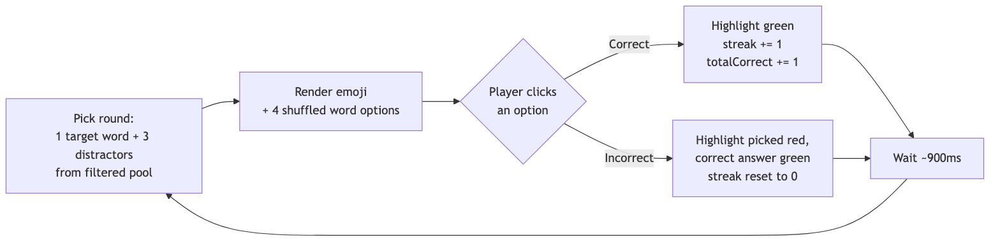

# Architecture

## Stack

| Layer | Choice | Why |
|---|---|---|
| UI framework | React + Vite | Component-based, fast dev server, scales cleanly if more game modes are added later. |
| State | React `useState`/`useMemo`, no external store | The state graph is small (current round, session streak, category filter) — a store like Redux/Zustand would be overhead for this size. |
| Persistence | Browser `localStorage` | No login needed for a two-person project; progress just needs to survive a page reload on the same device/browser. |
| Content | Static JSON (`src/data/words.json`) | Word bank is hand-curated and small; no need for a database or CMS. |
| Hosting | Static site (Vercel/Netlify/GitHub Pages) | The whole app is a static bundle — no backend to run or pay for. |

## Component / data flow


- **`src/data/words.json`** is the word bank — pure data, no logic. Loaded at build time like any other import.
- **`src/lib/round.js`** has two pure functions: `shuffle()` and `pickRound(pool, avoidId)`, which picks a random target word plus 3 distractors from whatever pool `Game.jsx` hands it. Pure functions here mean round selection is trivially testable without touching React.
- **`src/components/Game.jsx`** is the only component with real logic: it filters the word pool by category + unlocked level, holds the current round and session streak, and handles answer clicks.
- **`src/components/OptionButton.jsx`** is presentational — given an option and the current feedback state, it decides its own CSS class (`option--correct` / `option--incorrect` / `option--disabled`).
- **`src/hooks/useProgress.js`** owns the persisted progress (`totalCorrect`, `totalAnswered`, `bestStreak`), reading from and writing to `localStorage` on every change.
- **`src/App.jsx`** is just layout — header + `<Game />`. No game logic lives here so a second game mode could be added as a sibling of `Game` later without touching it.

## Game loop



Each round is stateless with respect to the previous one except for one thing: `pickRound` is told the previous target's id so it doesn't repeat the same word twice in a row.

## Why no backend

The two persistence questions that usually justify a backend — "does progress need to sync across devices?" and "does someone need to log in?" — were both answered no for v1 (see the project's earlier scoping conversation). If that changes, `useProgress.js` is the single seam to swap: it already isolates all read/write of progress behind two functions (`progress`, `recordAnswer`), so replacing `localStorage` with an API call wouldn't touch `Game.jsx` or `OptionButton.jsx`.

## Folder structure

```
src/
  data/
    words.json        # word bank
  hooks/
    useProgress.js     # persisted score/streak state
  lib/
    round.js           # pickRound() / shuffle()
  components/
    Game.jsx           # game screen + logic
    OptionButton.jsx    # one word-choice button
  App.jsx               # header + layout
  App.css               # game styling
  index.css             # theme variables, base styles
```
