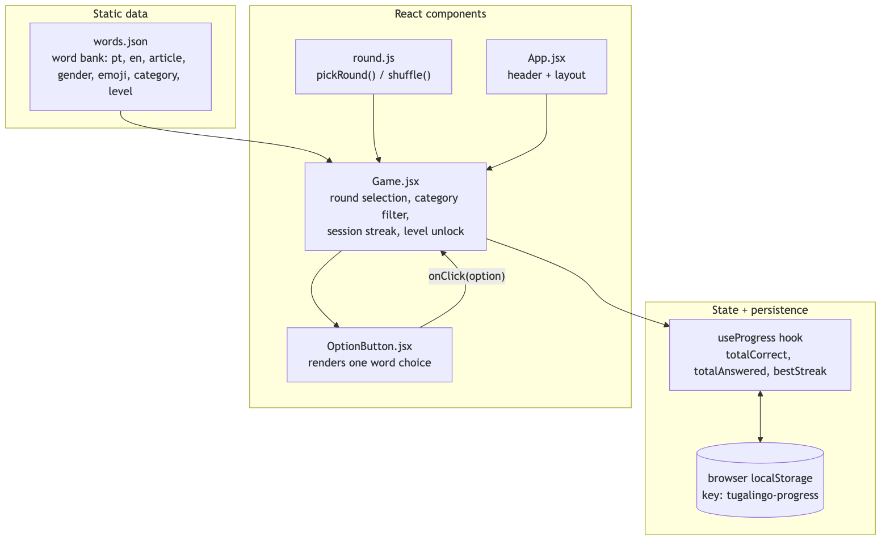
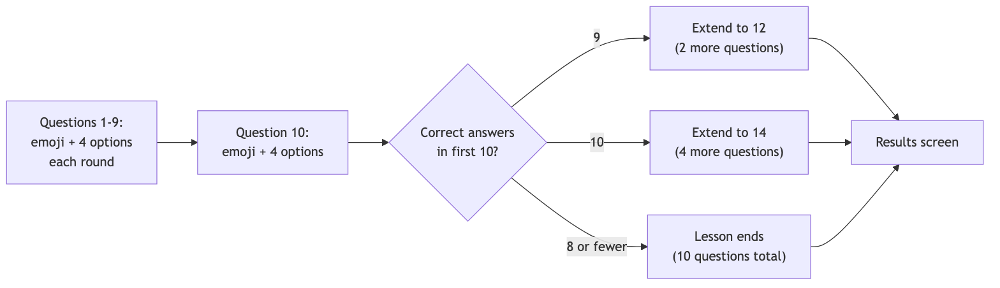

# Architecture

## Stack

| Layer | Choice | Why |
|---|---|---|
| UI framework | React + Vite | Component-based, fast dev server, scales cleanly as more screens/modes get added. |
| State | React `useState`/`useMemo`, no external store | The state graph is small (current screen, current lesson's round/progress) — a store like Redux/Zustand would be overhead for this size. |
| Accounts + persistence | [Supabase](https://supabase.com) (Postgres + Auth, magic-link email sign-in) | Progress now syncs across devices under a real account — see [Accounts & cloud progress sync](#accounts--cloud-progress-sync) below. Free tier easily covers a two-person app; picked over Firebase because Firebase's scheduled Cloud Functions (needed for reminder notifications) require the paid Blaze plan just to deploy, even at zero usage. |
| Content | Supabase (`content_items` table) | Word/verb/compound/phrase banks are hand-curated and small, but now editable in-app by admins — see [Content studio](#content-studio) below. `src/data/*.json` still exist as the original seed fixture (`scripts/seed-content.mjs`) and as test data. |
| Hosting | Static site (GitHub Pages) | The frontend is still a static bundle — Supabase *is* the backend, fully managed, nothing to run or pay for ourselves. |

## Component / data flow



- **`src/data/words.json`**/**`verbs.json`**/**`compounds.json`**/**`phrases.json`** are the original seed content — no longer read at runtime (see [Content studio](#content-studio)), but still used by `scripts/seed-content.mjs` and as realistic fixture data in tests.
- **`src/lib/lessons.js`** decides what content the *next* lesson draws from, given a loaded `content` bundle: `currentWordPool`/`currentVerbPool`/`currentCompoundPool`/`currentPhrasePool` (the difficulty ramp), `buildLessonContext(content, progress)` (bundles all four into one object), `activeQuestionTypes` (which question types are unlocked so far), and the extend-past-10 rule — pure functions, no React, no fetching of their own.
- **`src/lib/emoji.js`** — `pickEmoji(word)` picks one emoji from a word's `emoji` plus any `emojiVariants` each time it's asked, so a word with more than one valid emoji (e.g. a cat) doesn't always show the same glyph.
- **`src/lib/questionTypes/`** is the question-type registry — see [Question types](#question-types) below.
- **`src/lib/round.js`** picks a random target + 3 distractors from whatever pool it's handed; used by any multiple-choice question type (`emoji-match`, `reverse-match`, `sentence-fill`, `compound-match`, `gender-match`, `phrase-match`).
- **`src/lib/dates.js`** has the date helpers shared by the progress hook and the home screen: `dateKey`, `recentDays`, and `currentStreak`.
- **`src/lib/progressFile.js`** — `downloadProgress(progress)` and `parseProgressFile(file)`, the export/import logic (see [Progress export/import](#progress-exportimport) below).
- **`src/lib/debug.js`** — `isDebugMode()`, whether `?debug=true` is in the URL (see [Debug mode](#debug-mode) below).
- **`src/lib/studio.js`**, **`src/lib/studioPreview.js`** — the content studio's pure logic (see [Content studio](#content-studio) below).
- **`src/lib/contentStore.js`** — `fetchContent()`/`upsertContentEntry(kind, entry)`, the Supabase reads/writes behind both the game's content and the studio's edits (see [Content studio](#content-studio) below).
- **`src/lib/supabaseClient.js`** — creates the shared Supabase client from `VITE_SUPABASE_URL`/`VITE_SUPABASE_ANON_KEY` (or `null` if unset, guarded by `isSupabaseConfigured()`). See [Accounts & cloud progress sync](#accounts--cloud-progress-sync).
- **`src/lib/localProgress.js`** — reads whatever's left in `localStorage` from before accounts existed, for the one-time migration prompt (see below).
- **`src/hooks/useAuth.js`** — wraps Supabase Auth: the current `session` (`undefined` while resolving, `null` signed out), `signInWithEmail(email)` (magic link), `signOut()`.
- **`src/hooks/useProgress.js`** owns everything persisted, keyed by the signed-in user: the full history of completed lessons and which calendar days had activity. It exposes two write paths — `recordLessonCompletion(correct, total)`, called once when a lesson finishes, and `replaceProgress(newProgress)`, called on a successful import or migration. Exiting a lesson early calls neither.
- **`src/hooks/useContent.js`** — loads the word/verb/compound/phrase banks from Supabase once per signed-in session (see [Content studio](#content-studio)).
- **`src/hooks/useProfile.js`** — looks up the signed-in user's role (`regular`/`admin`) from the `profiles` table, exposing `isAdmin` (see [Content studio](#content-studio)).
- **`src/App.jsx`** first gates on Supabase being configured, then on auth (`useAuth`), progress (`useProgress`), and content (`useContent`) all being loaded, then on a session existing (rendering `Login` if not) — only past all that does it become the familiar screen router with five states: `home`, `lesson`, `debug`, `studio`, `results`. It's also where a lesson's content (`buildLessonContext`) and unlocked question types (`activeQuestionTypes`) are picked the moment "New Lesson" is pressed, and where the streak shown on the results screen is computed. No game logic lives here beyond that wiring.
- **`src/components/Login.jsx`** — the magic-link sign-in form shown when there's no session.
- **`src/components/Home.jsx`** — the home screen: streak header, `ActivityHeatmap`, the "New Lesson" button, the export/import buttons, (in debug mode / for admins) the Debug/Studio buttons, the signed-in-as/sign-out footer, and the one-time local-progress migration banner.
- **`src/components/Lesson.jsx`** — plays one lesson: the round loop, the question-10 extend check, the progress bar. It knows nothing about *what kind* of question it's showing — it asks the registry for one and renders whatever comes back (see below).
- **`src/components/DebugMenu.jsx`** — lists every question type for direct selection (see [Debug mode](#debug-mode) below).
- **`src/components/Studio.jsx`** — the content studio's UI (see [Content studio](#content-studio) below).
- **`src/components/questions/`** — one renderer component per question type, plus the registry (`QuestionRenderer`) that picks the right one, and `optionClassName.js`, a small shared helper so every choice-based renderer gets the same correct/incorrect/disabled styling without depending on each other.
- **`src/components/OptionButton.jsx`** — presentational, used by `EmojiMatchQuestion`, `CompoundMatchQuestion`, and `GenderMatchQuestion` (all have article+pt+gender-shaped choices); the other choice-based renderers (`ReverseMatchQuestion`, `SentenceFillQuestion`, `PhraseMatchQuestion`) render their own buttons since their content (an emoji, a bare word, a reply phrase) doesn't fit that layout, but share its feedback-class logic via `optionClassName.js`.
- **`src/components/LessonResults.jsx`** — the post-lesson score screen, including the updated streak.
- **`src/components/VersionBadge.jsx`** — the small commit-SHA link in the bottom corner, present on every screen. Reads a `__COMMIT_SHA__` global that `vite.config.js` injects at build time via `define`: it's `VITE_COMMIT_SHA` (set by `.github/workflows/deploy.yml` to `github.sha`) in CI, or the local working tree's `git rev-parse HEAD` otherwise, so it's meaningful in `npm run dev`/`build` too, not just the deployed site.

## Question types

Every question in a lesson is a plain data object plus a matching renderer, looked up by `type` — this is what makes adding a new kind of exercise additive rather than a rewrite of `Lesson.jsx`. Seven are implemented:

| Type | Prompt | Answer | Content pool |
|---|---|---|---|
| `emoji-match` | emoji | pick the word (4 choices) | `words` |
| `reverse-match` | word | pick the emoji (4 choices) | `words` |
| `phrase-match` | emoji + conversational phrase | pick the reply (4 choices) | `phrases` |
| `compound-match` | 2-3 emoji together | pick the word/phrase (4 choices) | `compounds` |
| `type-in` | emoji | type the word (free text) | `words` |
| `gender-match` | emoji + ♂/♀ symbol | pick the sex-matching word form (4 choices) | `words` (entries with `femaleForm`) |
| `sentence-fill` | emoji + pronoun | pick the conjugated verb form (4 choices) | `verbs` |

- **`src/lib/questionTypes/<type>.js`** — the logic half. Exports `type` (a string id), `generate(context, avoidWordId) -> Question`, and `isCorrect(question, answer) -> boolean`. `context` is the `{ words, verbs, compounds, phrases }` object from `buildLessonContext` — each module reads whichever field(s) it needs.
- **`src/lib/questionTypes/index.js`** — the registry. `generateQuestion(type, context, avoidWordId)` and `checkAnswer(question, answer)` dispatch to the right module by `question.type`. This is the only file that needs a new line added when a question type is added.
- **`src/components/questions/<Type>Question.jsx`** — the rendering half: takes `{ question, feedback, onAnswer }` and renders the prompt + answer UI, calling `onAnswer(answer)` when the player responds. `feedback` is `{ correct, answer }` once one has been submitted, or `null` before that.
- **`src/components/questions/index.jsx`** — the component registry (`QuestionRenderer`), keyed the same way as the logic registry above. It renders with `key={question.id}` so any question-local UI state (e.g. `TypeInQuestion`'s text input) resets between questions, even two of the same type back to back.

`Lesson.jsx` only ever calls `generateQuestion`, `checkAnswer`, and renders `<QuestionRenderer />` — it has no `if (type === ...)` branches, so it doesn't grow as question types are added. New types don't appear in every lesson from the moment they're registered, either — see `activeQuestionTypes` in [design.md](design.md#question-types) for the unlock progression. See [data-model.md](data-model.md#question-schema) for the exact `Question`/`Answer` shape.

## Lesson flow



A lesson is 10 questions minimum. At question 10, the running correct-count decides whether it extends — see [design.md](design.md#lesson-length-and-the-extend-rule) for the exact rule and the reasoning behind it.

## Debug mode

`isDebugMode()` (`src/lib/debug.js`) checks the URL for `?debug=true` on every render — it's not a persisted setting, so it never leaks into a normal session and there's nothing to remember to turn back off. When it's on, `Home.jsx` renders a "Debug" button alongside export/import that opens `DebugMenu.jsx`: a plain list of every question type (`ALL_QUESTION_TYPES` in `lessons.js`), regardless of whether a real player would have unlocked it yet.

Picking a type starts a normal `Lesson` (same 10-question/extend-rule loop as any other lesson), but with two differences from `startLesson()`:
- `questionTypes` is `[type]` instead of `activeQuestionTypes(progress)`, so every question in the round is the one type being previewed, not a mix.
- The context comes from `buildDebugLessonContext()` instead of `buildLessonContext(progress)` — it fakes just enough history to unlock every `level` tier, so e.g. `gender-match` (which only draws from level-1/2 words with a `femaleForm`) can be previewed on a completely fresh profile with zero real lessons played.

Debug lessons are also tagged `isDebug: true` on the `view` state in `App.jsx`, which `completeLesson` checks first: a debug lesson never calls `recordLessonCompletion`, and finishing (or exiting) one returns straight to the debug menu instead of the results screen — previewing a question type shouldn't add fake entries to real lesson history, streak, or the heatmap.

## Content studio

The word/verb/compound/phrase banks live in Supabase's `content_items` table now (`supabase/schema.sql`) — one row per entry, `{ kind, id, level, data }`, where `data` is the exact same shape the old `src/data/*.json` entries had. `src/lib/lessons.js` no longer statically imports those files; `src/hooks/useContent.js` fetches all four banks once per signed-in session via `src/lib/contentStore.js`'s `fetchContent()`, and `App.jsx` passes the result into `buildLessonContext`/`buildDebugLessonContext`. This means editing content now takes effect for every signed-in player immediately, with no rebuild or redeploy — the tradeoff (spelled out in [Accounts & cloud progress sync](#accounts--cloud-progress-sync) for progress applies here too) is that the game now needs a successful content fetch to be playable at all, not just a successful progress fetch.

Access to the *editor* is gated by role, not a URL flag like debug mode: `supabase/schema.sql`'s `profiles` table gives every account a `role` (`'regular'` by default, via an `on_auth_user_created` trigger that runs at signup) and `src/hooks/useProfile.js` exposes the signed-in user's `isAdmin`. `Home.jsx` only renders the "Studio" button when `isAdmin` is true, and the real enforcement is server-side: `content_items`' row-level security lets any authenticated user `select`, but only lets a row through `insert`/`update`/`delete` when `public.is_admin()` (a `security definer` SQL function checking `profiles.role`) returns true for the caller — so even someone who found a way to reach the Studio UI without the button couldn't actually write. There's no in-app way to grant admin; it's set by hand in the Supabase dashboard/SQL editor, consistent with the "Supabase dashboard is enough" choice already made for checking progress. The target account must have actually signed in at least once first (a `profiles` row can only exist for a real `auth.users` row); granting is then an upsert rather than a plain `update`, since the backfill/trigger may or may not have run yet for that account: `insert into profiles (id, role) values ('<uid>', 'admin') on conflict (id) do update set role = 'admin';`.

The logic is split the same way as before (pure logic in `src/lib/`, network calls kept thin, component is just wiring):

- **`src/lib/studio.js`** — pure, unit-tested, unchanged by this move. `emptyDraft(bank)` gives a blank form for a bank; `draftToEntry(bank, draft)` converts the flat form state into the actual entry shape (e.g. it only adds a `femaleForm` key at all if the checkbox is on and a word was actually typed); `entryToDraft(bank, entry)` is the inverse, used when clicking an existing entry in the list to edit it; `validateEntry(bank, entry, existingEntries, editingId)` checks required fields, a lowercase-hyphen-only `id`, and that the `id` isn't already used by a *different* entry.
- **`src/lib/studioPreview.js`** — pure, unit-tested, also unchanged. `previewQuestionFor(bank, entry, pool)` builds a real `Question` object (same shape `src/lib/questionTypes/` produces) for whatever's currently in the form, so the preview panel hands it straight to the actual `<QuestionRenderer />`. Each bank previews as its "primary" type (`words` as `emoji-match`, or `gender-match` if the draft has a female form; `verbs` as `sentence-fill`; `compounds` as `compound-match`; `phrases` as `phrase-match`), with distractors drawn from whatever else is currently loaded in that bank.
- **`src/lib/contentStore.js`** — `fetchContent()` reads every row and groups it back into `{ words, verbs, compounds, phrases }`; `upsertContentEntry(kind, entry)` writes one entry. Not unit tested, same reasoning as `useProgress.js`'s Supabase calls: real network wiring, verified manually/with mocked requests instead.

`Studio.jsx` loads all four banks on mount and saves each entry immediately on "Add entry"/"Save changes" (a real `upsert`, not a local-only edit) — there's no separate "Save to disk" step anymore, and no browser feature-detection gate, since this no longer depends on the File System Access API (Chrome/Edge only, as it did before) — any browser that can run the app can now edit content too.

A fresh Supabase project starts with an empty `content_items` table; `scripts/seed-content.mjs` regenerates the original seed data from `src/data/*.json` as a SQL script (`node scripts/seed-content.mjs > seed.sql`, then run it against the project), which is also how the live project was first populated.

## Progress export/import

`src/lib/progressFile.js` is plain, framework-free logic:

- `downloadProgress(progress)` — serializes the `progress` object to a JSON `Blob` and triggers a browser download via a throwaway `<a download>` element. No confirmation, since exporting is non-destructive.
- `parseProgressFile(file)` — reads a `File` (from a file `<input>`), `JSON.parse`s it, and validates the result actually has the progress shape (an array `history` of `{ completedAt, correct, total }` and an object `activityByDate` of `{ lessonsCompleted }`) before returning it. Throws a descriptive `Error` on anything that doesn't match, which `Home.jsx` catches and displays inline — nothing is ever applied to `progress` from an unvalidated file.

`Home.jsx` wires these to a hidden file `<input>` and a native `window.confirm()` (the only confirmation dialog in the app, since import is the only destructive action — it fully replaces `progress` via `replaceProgress`). See [data-model.md](data-model.md#progress-file-import--export) for the exact validation rules and [ux-ui.md](ux-ui.md#export--import-progress) for the UI. This still works exactly as before now that progress is cloud-synced — it's a manual backup/transfer path alongside the automatic one.

## Accounts & cloud progress sync

Progress now lives in Supabase Postgres, one row per user, instead of only in `localStorage`. This is what makes cross-device sync and (eventually) reminder notifications possible — see [data-model.md](data-model.md#progress--supabase-progress-table) for the exact schema and RLS policy.

- **Auth**: magic-link email sign-in only (`supabase.auth.signInWithOtp` via `useAuth.js`) — no password to set, reset, or leak, and Supabase auto-creates the `auth.users` row on first use. There's no separate registration flow.
- **`App.jsx` gating**: before rendering the normal screen router, it checks (in order) that Supabase is configured (`isSupabaseConfigured()`), that auth has resolved (`useAuth`'s `isLoading`), that a session exists (else renders `Login.jsx`), and that progress has loaded (`useProgress`'s `isLoading`). Only past all four does `home`/`lesson`/etc. render.
- **`useProgress(userId)`** keeps the exact same external interface it had with `localStorage` (`progress`, `recordLessonCompletion`, `replaceProgress`) — this was the seam the app was already built around, and it held up: `Lesson.jsx`, `Home.jsx`, and `LessonResults.jsx` needed no changes. What's different internally: the initial load is now an async `select` (hence the new `isLoading` flag) instead of a synchronous `localStorage.getItem`, and every write is a Postgres `upsert` instead of a synchronous `localStorage.setItem`. One real tradeoff: recording a completed lesson now requires a network connection — there's no offline write buffer in this version.
- **Row Level Security**: the `progress` table (and any future per-user table) has RLS enabled with a single `auth.uid() = user_id` policy for all operations, so a user can only ever read or write their own row — enforced by Postgres, not app code.
- **Migrating pre-accounts local progress**: `src/lib/localProgress.js`'s `readLocalProgress()` checks for real progress left in `localStorage` from before this feature existed (same validation as file import, via `progressFile.js`'s `isValidProgress`). If found, and the signed-in user's server-side history is still empty, `Home.jsx` shows a one-time banner offering to import it (`App.jsx`'s `handleMigrate`, which just calls `replaceProgress`) or dismiss it permanently (`dismissMigration()`, a `localStorage` flag so it doesn't nag on every load).
- **Why Supabase over a custom server or Firebase**: no server to run or pay for — Supabase's free tier (Postgres + Auth) is a fully managed backend, and its Edge Functions support free scheduled ("cron") execution, which Firebase's equivalent (Cloud Functions) doesn't without the paid Blaze plan — relevant for the reminder-notification feature this groundwork exists for. Frontend hosting is unchanged (still a static bundle on GitHub Pages).

## Tests

Everything under `src/lib/` (and its `questionTypes/` subfolder) is plain, framework-free logic — no DOM, no React — which makes it straightforward to unit test in isolation with [Vitest](https://vitest.dev), without needing a browser or React Testing Library. Each module has a co-located `*.test.js` file (e.g. `src/lib/dates.test.js` next to `dates.js`).

What's covered: the date/streak math (`dates.js`), shuffling and round-picking (`round.js`), emoji-variant selection (`emoji.js`), the difficulty ramp and question-type unlock schedule (`lessons.js`, now driven by a passed-in content bundle rather than a static import), progress file validation (`progressFile.js`), the pre-accounts local-progress migration check (`localProgress.js`), the `?debug=true` check (`debug.js`), the content studio's draft/entry conversion, validation, and preview-question building (`studio.js`, `studioPreview.js`), and every question type's `generate`/`isCorrect` pair — most with small hand-written fixtures for clarity, plus one test (`questionTypes/index.test.js`) that runs every type against the real `words.json`/`verbs.json`/`compounds.json`/`phrases.json` banks (still kept as fixtures) as an end-to-end sanity check that the actual seed content is well-formed.

Deliberately not covered: React components (`src/components/`), `progressFile.js`'s `downloadProgress`, and `useAuth.js`/`useProgress.js`/`useContent.js`/`useProfile.js`/`contentStore.js`'s actual Supabase network calls (all need a real DOM/browser API or a real backend with nothing but wiring to test) — these are thin rendering/wiring layers verified manually in a real browser instead (or with mocked network requests, for the studio's save flow and the login form's OTP call), since the bulk of this app's actual bug surface (question generation, correctness checking, date math) lives in the logic layer above.

`npm test` runs the suite once; `npm run test:watch` re-runs on file changes. CI (`.github/workflows/deploy.yml`) runs `npm test` before `npm run build`, so a broken test blocks deployment the same way a broken build would.

## Folder structure

```
src/
  data/
    words.json          # noun/vocab bank (seed data + test fixtures only, see Content studio)
    verbs.json           # verb-conjugation bank (seed data + test fixtures only)
    compounds.json        # multi-emoji compound-concept bank (seed data + test fixtures only)
    phrases.json           # conversational prompt/reply bank (seed data + test fixtures only)
  hooks/
    useAuth.js            # Supabase session, signInWithEmail(), signOut()
    useProgress.js         # persisted lesson history + daily activity, Supabase-backed
    useContent.js           # word/verb/compound/phrase banks, Supabase-backed
    useProfile.js            # signed-in user's role, exposes isAdmin
  lib/
    lessons.js              # pools, buildLessonContext(content, progress), activeQuestionTypes(), extend rule
    emoji.js                 # pickEmoji() — random emoji variant per question
    supabaseClient.js          # shared Supabase client, isSupabaseConfigured()
    localProgress.js             # pre-accounts localStorage migration check
    questionTypes/
      emojiMatch.js         # emoji -> pick the word
      reverseMatch.js        # word -> pick the emoji
      phraseMatch.js           # conversational phrase -> pick the reply
      compoundMatch.js           # multiple emoji together -> pick the word/phrase
      typeIn.js                    # emoji -> type the word
      genderMatch.js                 # emoji + gender symbol -> pick the sex-matching word form
      sentenceFill.js                  # verb conjugation fill-in-the-blank
      index.js                           # question-type registry: generateQuestion(), checkAnswer()
    round.js               # pickRound() / shuffle()
    dates.js                # dateKey(), recentDays(), currentStreak()
    progressFile.js          # downloadProgress(), parseProgressFile()
    debug.js                  # isDebugMode()
    studio.js                   # content studio: draft <-> entry, validateEntry()
    studioPreview.js              # content studio: previewQuestionFor()
    contentStore.js                 # content studio: fetchContent(), upsertContentEntry()
  components/
    Login.jsx                # magic-link sign-in form
    Home.jsx                  # home screen: streak + heatmap + New Lesson + export/import + Debug/Studio (admin-only) + account
    ActivityHeatmap.jsx        # calendar heatmap
    Lesson.jsx                  # plays one lesson, question-type-agnostic
    DebugMenu.jsx                # debug mode: pick any question type directly
    Studio.jsx                     # content studio: add/edit content_items entries with live preview
    questions/
      EmojiMatchQuestion.jsx   # renders emoji-match
      ReverseMatchQuestion.jsx  # renders reverse-match
      PhraseMatchQuestion.jsx     # renders phrase-match
      CompoundMatchQuestion.jsx    # renders compound-match
      TypeInQuestion.jsx             # renders type-in
      GenderMatchQuestion.jsx          # renders gender-match
      SentenceFillQuestion.jsx           # renders sentence-fill
      optionClassName.js                   # shared correct/incorrect/disabled class logic
      index.jsx                             # component registry: <QuestionRenderer />
    OptionButton.jsx          # word-choice button (article + pt + gender)
    LessonResults.jsx          # post-lesson score + streak screen
    VersionBadge.jsx            # commit-SHA link, bottom corner, every screen
  App.jsx                      # screen router (home / lesson / debug / studio / results)
  App.css                       # all styling
  index.css                      # theme variables, base styles
```

(Not shown above: every file directly under `lib/` and `lib/questionTypes/` has a co-located `*.test.js` — see [Tests](#tests).)

Outside `src/`: `supabase/schema.sql` is every table (`progress`, `profiles`, `content_items`), function, trigger, and RLS policy, run once against the Supabase project's Postgres via the SQL Editor (or `psql`); `scripts/seed-content.mjs` turns `src/data/*.json` into a one-time SQL seed for `content_items`; `.env.example` documents the two Vite env vars (`VITE_SUPABASE_URL`, `VITE_SUPABASE_ANON_KEY`) needed in `.env` locally and as GitHub Actions repo secrets for the deploy workflow.
