# UX / UI

## Visual style

Deliberately plain: white background, one accent color (purple), system font, no mascot. Theme variables (`src/index.css`) already support dark mode via `prefers-color-scheme`, inherited from the Vite template.

## Screen: home

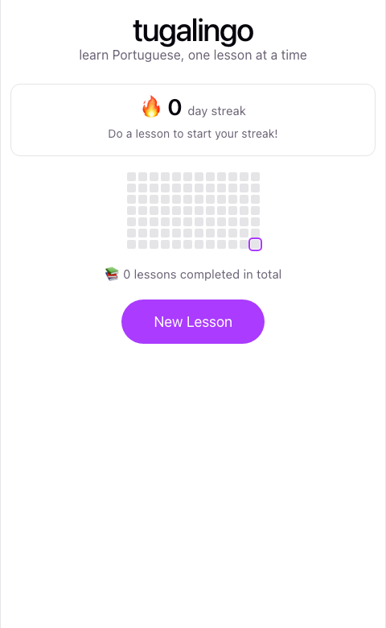

This is the first thing the player sees, and everything on it is progress-driven:

- **Streak header** — a large `🔥 N day streak`, with a status line underneath that changes depending on the day: *"Do a lesson to start your streak!"* with no streak yet, *"Do a lesson today to keep your streak!"* if there's a streak but today isn't done, or *"Lesson done today ✅"* once it is (the block also turns green at that point). This is the single most prominent thing on the screen on purpose — see [design.md](design.md#streak--daily-activity) for why.
- **Activity heatmap** — the last 30 days, one cell per day, shaded by how many lessons were completed that day. Today's cell has a purple outline so it's easy to find, and it's always the very last cell (bottom-right) — the grid reads chronologically, oldest at top-left, wrapped into rows of 7 (`recentDays` in `src/lib/dates.js`), with the leftover days from the incomplete first week padded as empty cells at the top-left rather than the grid's width changing from day to day. Because rows are always exactly 7 days apart, every column still lines up with one consistent weekday all the way down. Unlike the streak number, this never resets — it's the honest longer-term record even across a broken streak.
- **Lifetime stat** — total lessons completed, ever.
- **New Lesson button** — the only way to start playing. There's no lesson list, no numbering, no map to navigate.
- **Export/Import progress** — two small secondary buttons below New Lesson, deliberately understated (plain outlined buttons, not accent-colored) so they don't compete with the primary action. See [below](#export--import-progress).
- **Debug** — a third button in that same row, but only when the page was loaded with `?debug=true` in the URL; otherwise it doesn't render at all. See [below](#debug-mode).

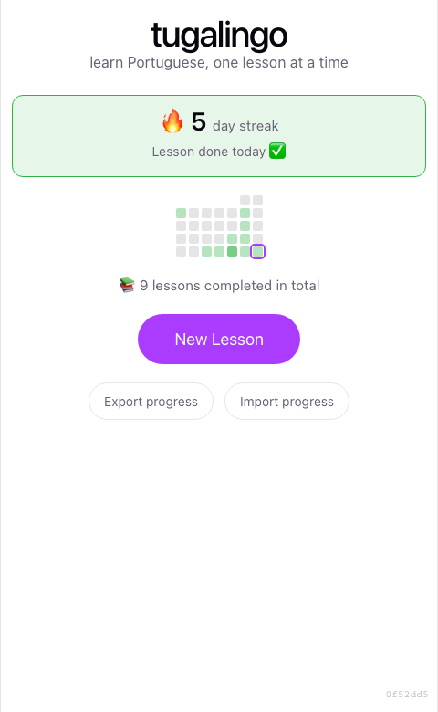

Once a lesson is completed: the streak block updates and turns green, the heatmap gets a colored cell for today, and the lifetime count increments.

## Export / import progress

- **Export progress** downloads the current `localStorage` progress object as a JSON file (`tugalingo-progress-<today's date>.json`) — no dialog, just an immediate browser download.
- **Import progress** opens a native file picker. If the chosen file parses as a valid progress export, a browser `confirm()` warns that it will replace everything currently on this device before applying it — this is the one destructive action in the app, so it's the one place that interrupts with a confirmation. If the file doesn't parse, or doesn't look like a progress export, an inline message explains why and nothing is changed.
- Both read from and write to the same `progress` state as everything else (via `replaceProgress` in `useProgress.js`) — home, the streak, and the heatmap all reflect an import immediately, the same as finishing a lesson would.

See [architecture.md](architecture.md#why-no-backend) and [data-model.md](data-model.md#progress-file-import--export) for why this exists: it's the workaround for there being no accounts or cross-device sync.

## Debug mode

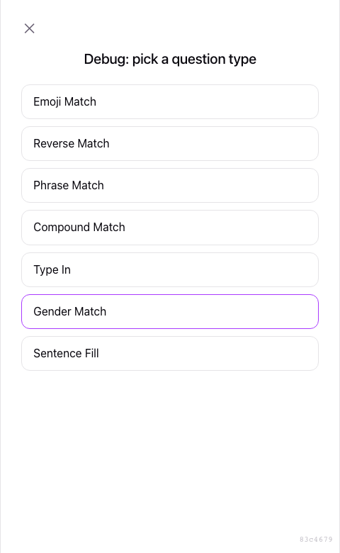

Loading the app with `?debug=true` in the URL (e.g. `https://takecare.github.io/tugalingo/?debug=true`) reveals a "Debug" button on the home screen, which opens a plain list of every question type that exists — including ones the current player hasn't unlocked yet, and ones that need level-2 content even on a completely fresh profile. Picking one starts a normal lesson made up entirely of that type, so a specific mechanic can be previewed end-to-end without playing through the real unlock ramp first.

A debug lesson plays out exactly like a real one (same 10-question loop, same extend rule, same feedback), but finishing or exiting it returns to this menu instead of the results screen, and nothing is written to progress — no streak, no heatmap cell, no lesson-history entry. It's purely a preview tool, not a way to grind fake progress. See [architecture.md](architecture.md#debug-mode) for how that's implemented.

## Screen: playing a lesson

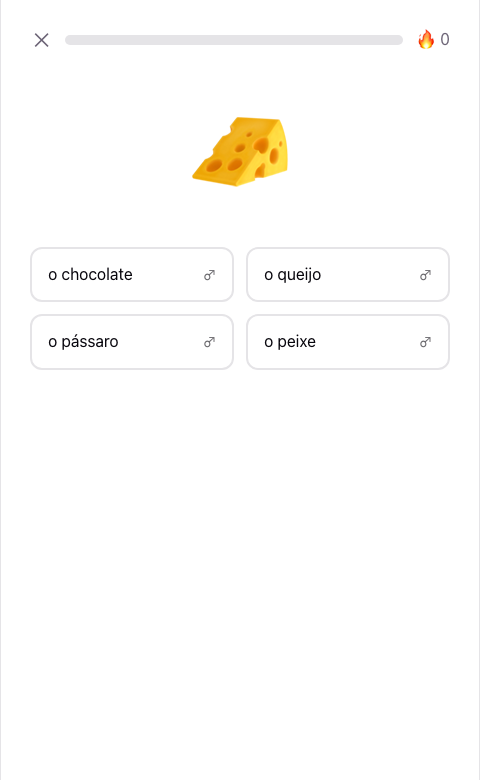

Top bar, left to right:
- **✕ exit** — leaves the lesson and returns home *without recording anything* — no partial credit, no streak/heatmap update. There's no confirmation dialog; abandoning a lesson has no cost beyond the time spent, since nothing is saved until it's completed.
- **Progress bar** — fills based on `question index / total questions for this lesson`. Because the total can grow (10 → 12 or 14) partway through, that fraction alone would make the bar jump backwards right when a lesson extends (e.g. 10/10 → 10/12); `Lesson.jsx` tracks the highest fraction shown so far and never lets the displayed width drop below it, so the bar holds steady through the extend point and only resumes climbing once real progress catches back up.
- **🔥 in-lesson streak** — consecutive correct answers *within this lesson only*. This is a different number from the home screen's day-streak (same fire emoji, different meaning: one is about right answers in a row, the other about consecutive days played) — resets every lesson, never persisted.

Below that, the prompt and answer UI vary by question type (see [design.md](design.md#question-types) for what unlocks when):

- **`emoji-match`** — the emoji prompt, then four word options in a 2×2 grid (as above). The emoji shown can vary between attempts if the word has more than one valid one (a cat question might show 🐱 one time, 🐈 the next) — see [design.md](design.md#emoji-variants).
- **`reverse-match`** — the mirror image: the word (with article + gender badge) is shown large where the emoji usually is, and the four options are big emoji buttons instead of word buttons.

  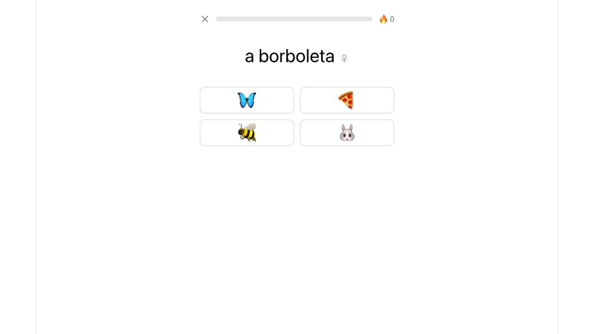

- **`phrase-match`** — an emoji sets the scene, with a short Portuguese question or exclamation below it (e.g. *"Como estás?"*), and four reply options in the same 2×2 grid as `sentence-fill`.

  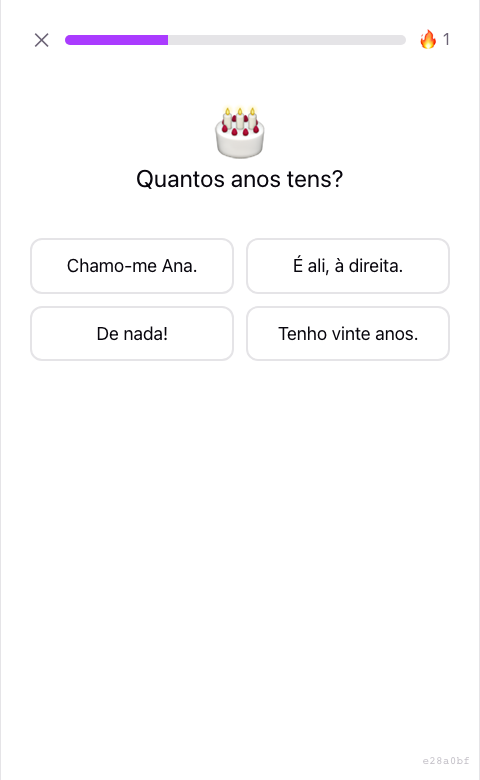

- **`compound-match`** — a short row of 2-3 emoji together as the prompt (e.g. a coffee cup next to two milk glasses), then four word/phrase options in the same 2×2 grid as `emoji-match`.

  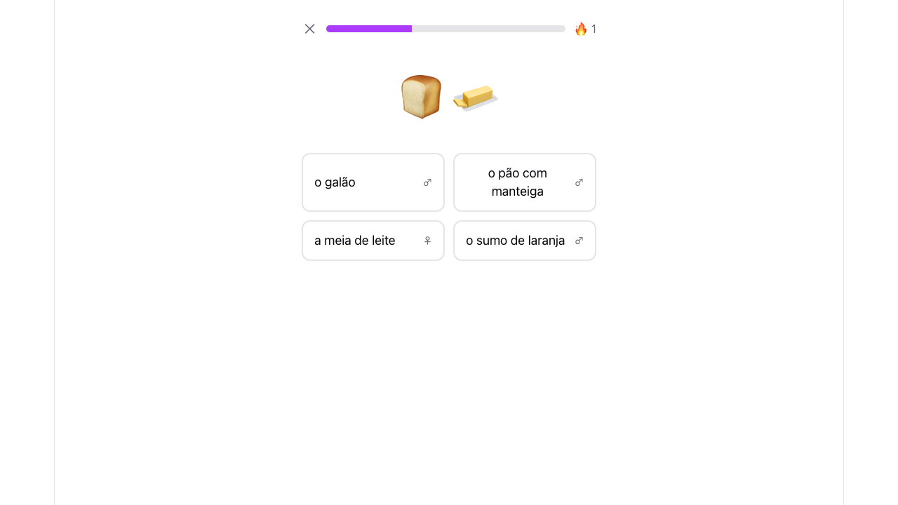

- **`type-in`** — the emoji prompt, but instead of a 2×2 grid there's a single text field and a "Check" button; Enter submits too.

  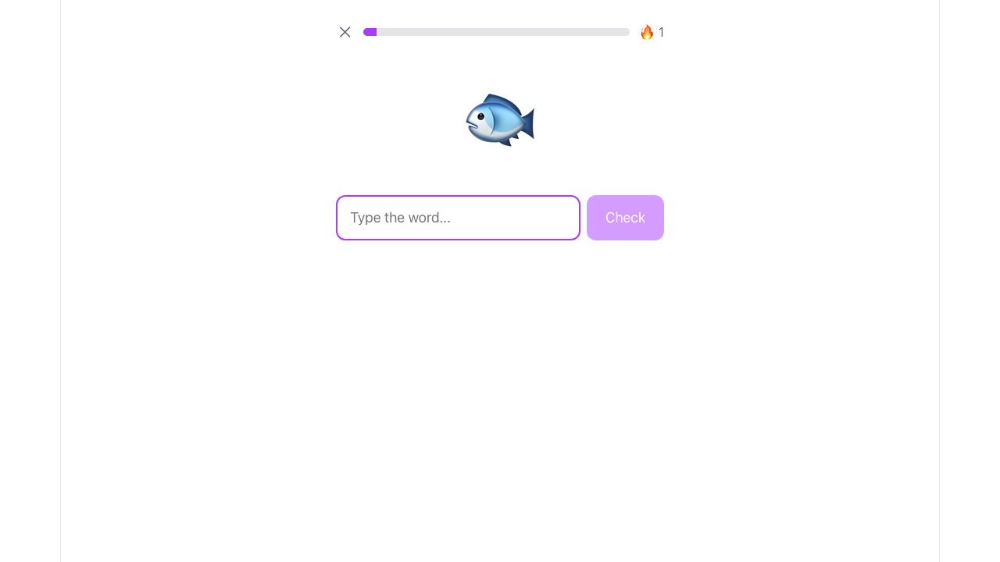

- **`gender-match`** — the emoji plus a large colored ♂ (blue) or ♀ (pink) symbol as the prompt, then four word options in the same 2×2 grid as `emoji-match` — but this time the four options are the word's masculine and feminine forms mixed with other animals', so picking correctly means matching the word form to the symbol shown, not just recognizing the animal.

  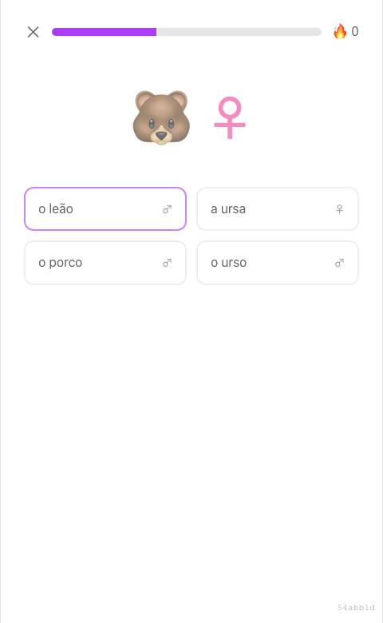

- **`sentence-fill`** — an emoji sets the scene, with a one-line sentence below it (a pronoun, a blank, a period — e.g. *"Ele/Ela ____."*), and four conjugated-verb-form buttons.

  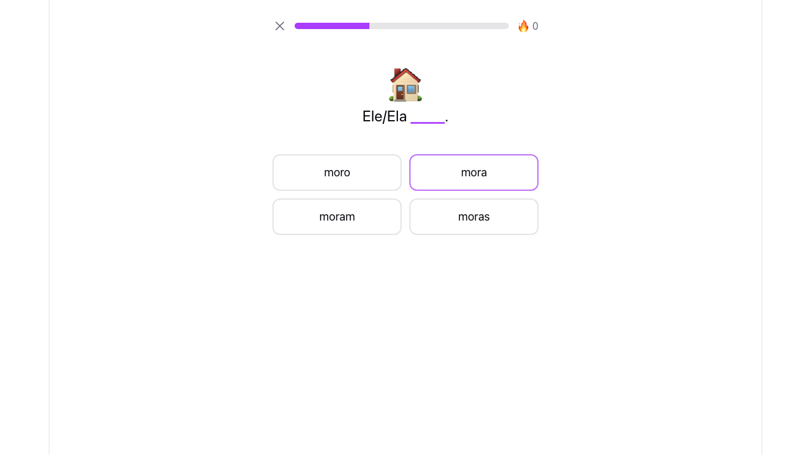

## State: correct / incorrect answer

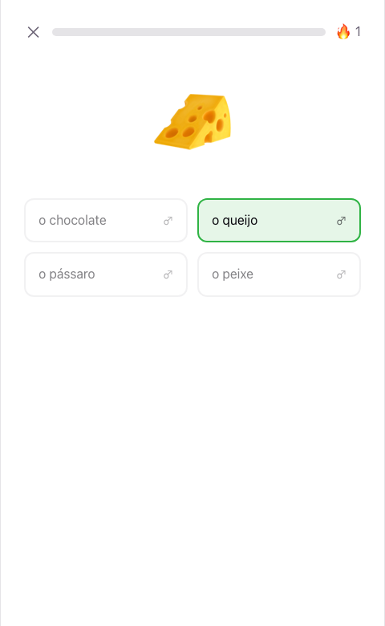
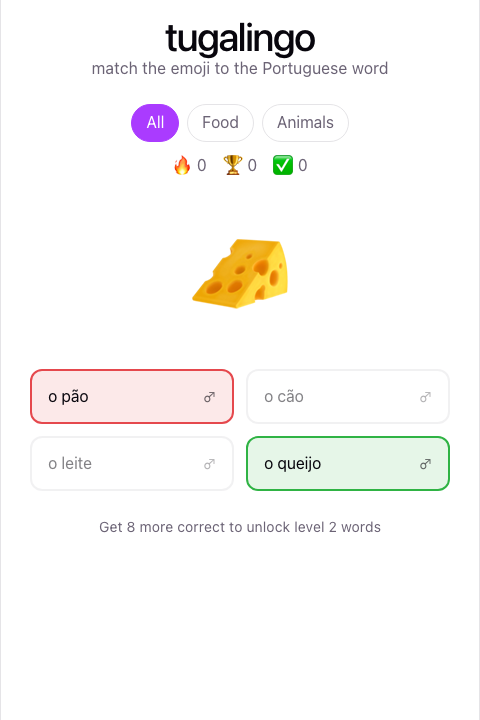

The chosen option highlights immediately (green for correct; red for incorrect with the actual correct option also turned green), all four options disable so a fast double-click can't double-answer, and the next round loads automatically after ~900ms. This applies the same way across every choice-based question type (`emoji-match`, `reverse-match`, `phrase-match`, `compound-match`, `gender-match`, `sentence-fill`) via a shared class helper (`optionClassName.js`) so the feedback always looks and feels the same regardless of what's being asked. `type-in` has no choices to highlight, so it colors the input's border instead (green/red) and shows the correct answer as text underneath when wrong.

## Screen: lesson results

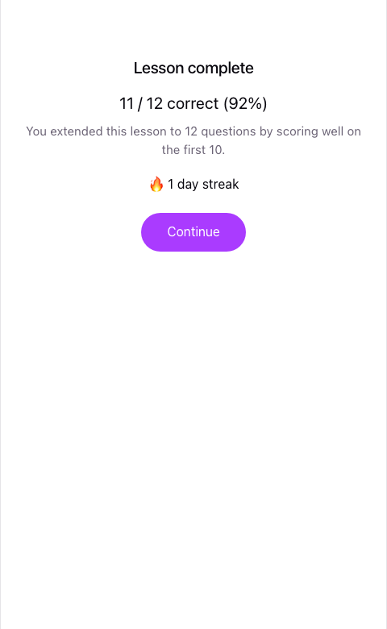

Shown once the lesson ends (at 10, 12, or 14 questions). Always shows the raw score and percentage, plus up to two conditional lines and the updated day-streak:
- If the lesson extended past 10, a line explains why ("You extended this lesson to N questions...") so the length change doesn't feel arbitrary.
- If this attempt beat the best score in the player's whole history, a "🏆 New best score!" line appears — but only from the second lesson ever onward, since a first-ever attempt is trivially a "best."
- The day-streak (`🔥 N day streak`) is shown reflecting *this* completion, so the habit-loop payoff is immediate rather than waiting until back on the home screen.

A single "Continue" button returns home, where the streak, heatmap, and lifetime count have already updated.

## Version badge

A small, low-opacity commit SHA sits fixed in the bottom-right corner on every screen, linking to that commit on GitHub. It's the deployed commit in production (set from `github.sha` by `.github/workflows/deploy.yml`), or the local working tree's commit when running `npm run dev`/`build` — see [architecture.md](architecture.md#component--data-flow) for how it's injected. Deliberately unobtrusive (11px, 40% opacity) since it's a debugging aid, not something a player needs to see.

## Interaction notes

- The 900ms delay between answering and the next round is a fixed constant in `Lesson.jsx` — long enough to read the correction, short enough that even a 14-question lesson doesn't feel padded.
- No animation library — color transitions are a plain CSS `transition` on `border-color`/`background`, and the next-question reveal is a plain CSS `@keyframes` fade-and-rise (`.question-enter` in `src/App.css`) triggered by giving the question wrapper a new `key` (the question index) each time `Lesson.jsx` advances — no JS animation logic, React just remounts the element and the CSS plays on mount. Respects `prefers-reduced-motion: reduce`.
- The home screen and results screen both read from the same `progress` object returned by `useProgress()` — there's no separate "refresh" step; finishing a lesson updates state once and every screen that depends on it re-renders from that.
