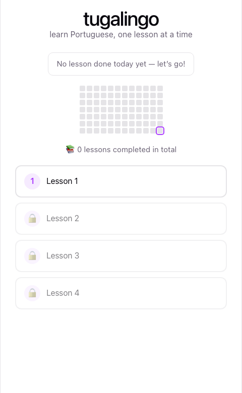
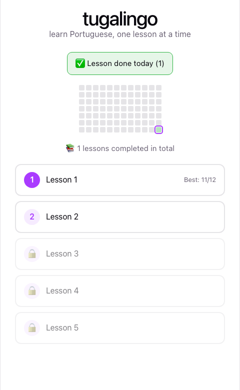
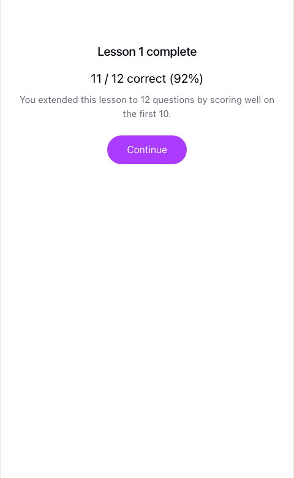

# UX / UI

## Visual style

Deliberately plain: white background, one accent color (purple), system font, no mascot. Theme variables (`src/index.css`) already support dark mode via `prefers-color-scheme`, inherited from the Vite template.

## Screen: lesson map (home)

This is the first thing the player sees, and everything on it is progress-driven:

- **Today banner** — "No lesson done today yet" until the first lesson of the day finishes, then flips to a green "✅ Lesson done today (N)". This is the single fastest answer to "did she practice today."
- **Activity heatmap** — the last 12 weeks, one cell per day, shaded by how many lessons were completed that day (see below). Today's cell has a purple outline so it's easy to find.
- **Lifetime stat** — total lessons completed, across all lessons and replays.
- **Lesson path** — a vertical list of lesson nodes. The next unlocked lesson is clickable and shown in the accent color; a few upcoming locked lessons are shown greyed out with a 🔒 so there's always a visible sense of "what's next," same as a Duolingo skill path.

Once a lesson is completed: its node shows a filled circle and a "Best: X/Y" score, the next lesson unlocks, the today banner goes green, and the heatmap gets a colored cell for today.

## Screen: playing a lesson

Top bar, left to right:
- **✕ exit** — leaves the lesson and returns to the map without recording anything. No confirmation dialog; abandoning a lesson has no penalty since nothing is saved until it's completed.
- **Progress bar** — fills based on `question index / total questions for this lesson`. Because the total can change (10 → 12 or 14) partway through, the bar's denominator updates the moment the lesson extends, rather than jumping or resetting.
- **🔥 streak** — consecutive correct answers *within this lesson only*. Resets every lesson; nothing about it is persisted.

Below that: the emoji prompt, then four word options in a 2×2 grid — same interaction as the original matching mode, unchanged.

## State: correct / incorrect answer

Unchanged from the original design: the chosen option highlights immediately (green for correct; red for incorrect with the actual correct option also turned green), all four options disable so a fast double-click can't double-answer, and the next round loads automatically after ~900ms.

## Screen: lesson results

Shown once the lesson ends (at 10, 12, or 14 questions). Always shows the raw score and percentage. Two extra lines appear conditionally:
- If the lesson extended past 10, a line explains why ("You extended this lesson to N questions...") so the length change doesn't feel arbitrary.
- If this attempt beat the previous best for that lesson, a "🏆 New best!" line appears — but only from the second attempt onward, since a first-ever attempt is trivially a "best" and calling that out wouldn't mean anything.

A single "Continue" button returns to the lesson map, where the just-played lesson's node and the heatmap have already updated.

## Interaction notes

- The 900ms delay between answering and the next round is a fixed constant in `Lesson.jsx` — long enough to read the correction, short enough that even a 14-question lesson doesn't feel padded.
- No animation library — color transitions are a plain CSS `transition` on `border-color`/`background` (see `src/App.css`).
- The lesson path, heatmap, and results screen all read from the same `progress` object returned by `useProgress()` — there's no separate "refresh" step; finishing a lesson updates state once and every screen that depends on it re-renders from that.
