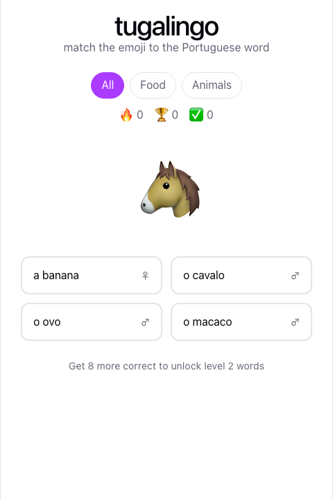
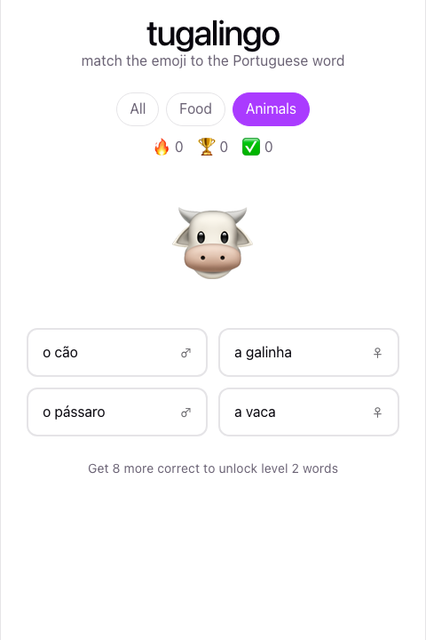

# UX / UI

## Visual style

Deliberately plain: white background, one accent color (purple), system font, no mascot. Everything is a single screen; there's no navigation to get lost in.

Theme variables (`src/index.css`) already support dark mode via `prefers-color-scheme`, inherited from the Vite template — not custom-built for this project, but free to keep.

## Screen: idle / prompt

Top to bottom:
- **Title + subtitle** — states what to do ("match the emoji to the Portuguese word") so the game needs no separate tutorial/instructions screen.
- **Category picker** (`All` / `Food` / `Animals`) — pill buttons, active one filled in the accent color.
- **Stats row** — 🔥 current streak, 🏆 best streak ever, ✅ lifetime correct. All three visible at once rather than tucked behind a menu, since they're the entire feedback loop for "am I improving."
- **Emoji** — large (96px), the sole prompt.
- **Four word options** in a 2×2 grid — big tap targets, deliberately not a dropdown or text input (no typing = no accidental English-keyboard-diacritics friction for a non-native speaker of Portuguese).
- **Unlock hint** ("Get N more correct to unlock level 2 words") — only shown while still on level 1, gives a visible reason to keep playing.

## Screen: category filter applied

Switching category is instant and doesn't interrupt a streak — filtering is a lens on the same pool, not a different mode. This was a deliberate choice so the player can specialize (e.g. drill only animals) without feeling like they're "leaving" the game.

## State: correct answer

The chosen option turns green immediately. No modal, no sound (yet), no blocking dialog — feedback has to be readable in the ~900ms window before the next round loads, so it's a color change on the option itself rather than a separate feedback panel that would shift the layout.

## State: incorrect answer

The picked option turns red *and* the correct option turns green at the same time, so the player sees the right answer immediately rather than having to guess again — this is a vocabulary-building game, not a quiz with withheld answers. All other (non-selected, non-correct) options dim slightly (`option--disabled`) so the eye goes to the two that matter.

## Interaction notes

- All four options are disabled the instant one is clicked, so a fast double-click can't register two answers for one round.
- The 900ms delay between answer and next round is a fixed constant in `Game.jsx` — long enough to read the correction, short enough that a full session doesn't feel padded.
- No animation library — the color transitions are a plain CSS `transition` on `border-color`/`background` (see `src/App.css`), kept deliberately simple.
